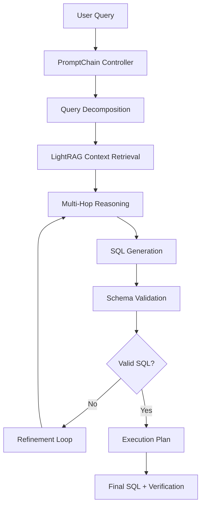

# Product Requirements Document: LightRAG Multi-Hop Reasoning System for Athena Database

## 📋 **Project Overview**

### **Project Name**
LightRAG Multi-Hop Reasoning System with PromptChain Integration

### **Use Case**
Advanced query processing for Athena medical database using LightRAG's knowledge graph capabilities combined with PromptChain's structured reasoning framework to handle complex patient/clinic/operational queries requiring multi-step reasoning and SQL generation.

### **Project Scope**
- **Primary Focus**: Multi-hop reasoning for complex medical database queries
- **Data Source**: Athena medical database via LightRAG knowledge graph
- **Processing Approach**: React-like pattern with PromptChain for iterative query refinement
- **Output**: Verified SQL code with execution plans and validation
- **Integration**: LightRAG + PromptChain + SQL verification pipeline

---

## 🎯 **Problem Statement**

### **Current Limitations**
1. **Single-Shot Queries**: Current LightRAG queries are one-shot, not suitable for complex multi-step reasoning
2. **No SQL Generation**: LightRAG provides context but doesn't generate executable SQL
3. **No Query Verification**: No validation of generated SQL against actual database schema
4. **Limited Reasoning Chain**: No iterative refinement based on intermediate results

### **Target Capabilities**
1. **Multi-Hop Reasoning**: Break complex queries into logical steps
2. **SQL Generation**: Generate executable SQL with proper joins and relationships
3. **Query Verification**: Validate SQL against actual Athena schema
4. **Iterative Refinement**: Use intermediate results to refine subsequent queries
5. **Execution Planning**: Provide execution plans and performance estimates

---

## 🏗️ **System Architecture**

### **Core Components**



### **Integration Points**

1. **LightRAG Knowledge Graph**: Source of truth for database schema and relationships
2. **PromptChain Framework**: Orchestrates multi-step reasoning process
3. **SQL Validator**: Validates generated SQL against Athena schema
4. **Execution Engine**: Plans and executes SQL queries safely

---

## 🔧 **Technical Requirements**

### **1. LightRAG Integration**

#### **Enhanced Query Capabilities**
```python
class MultiHopLightRAG:
    def __init__(self, working_dir: str):
        self.rag = LightRAG(working_dir=working_dir)
        self.conversation_history = []
        self.reasoning_steps = []
    
    async def multi_hop_query(self, query: str, max_hops: int = 3):
        """Execute multi-hop reasoning query"""
        steps = []
        current_context = ""
        
        for hop in range(max_hops):
            # Get context from LightRAG
            context = await self._get_context_for_hop(query, current_context, hop)
            
            # Process with PromptChain
            reasoning_result = await self._process_with_promptchain(
                query, context, steps, hop
            )
            
            steps.append(reasoning_result)
            current_context = reasoning_result['context']
            
            # Check if we have enough information
            if reasoning_result['complete']:
                break
        
        return self._synthesize_final_result(steps)
```

#### **Context Retrieval Strategies**
- **Local Mode**: For specific table/column relationships
- **Global Mode**: For high-level schema understanding
- **Hybrid Mode**: For comprehensive multi-table queries
- **Custom Mode**: For specialized medical domain queries

### **2. PromptChain Integration**

#### **React Pattern Implementation**
```python
class PromptChainController:
    def __init__(self, lightrag_instance):
        self.lightrag = lightrag_instance
        self.reasoning_chain = []
    
    async def process_query(self, user_query: str):
        """Main processing loop using React pattern"""
        
        # Step 1: Query Analysis
        analysis = await self._analyze_query(user_query)
        
        # Step 2: Schema Discovery
        schema_info = await self._discover_schema(analysis)
        
        # Step 3: Relationship Mapping
        relationships = await self._map_relationships(schema_info)
        
        # Step 4: SQL Generation
        sql_query = await self._generate_sql(analysis, schema_info, relationships)
        
        # Step 5: Validation & Refinement
        validated_sql = await self._validate_and_refine(sql_query)
        
        return {
            'analysis': analysis,
            'schema': schema_info,
            'relationships': relationships,
            'sql': validated_sql,
            'execution_plan': await self._generate_execution_plan(validated_sql)
        }
```

#### **Prompt Templates**
```python
QUERY_ANALYSIS_PROMPT = """
Analyze this medical database query and identify:
1. Primary entities (patients, appointments, procedures, etc.)
2. Required relationships (joins needed)
3. Filtering criteria
4. Output requirements
5. Complexity level (simple, moderate, complex)

Query: {query}
"""

SCHEMA_DISCOVERY_PROMPT = """
Based on the query analysis, discover the relevant database schema:
1. Primary tables needed
2. Column names and data types
3. Primary and foreign key relationships
4. Indexes and constraints
5. Data volume estimates

Use LightRAG context: {context}
"""

SQL_GENERATION_PROMPT = """
Generate optimized SQL query for Athena database:
1. Use proper JOIN syntax
2. Include appropriate WHERE clauses
3. Add necessary GROUP BY and ORDER BY
4. Consider performance implications
5. Include comments explaining the logic

Schema: {schema}
Relationships: {relationships}
Requirements: {requirements}
"""
```

### **3. Multi-Hop Reasoning Patterns**

#### **Patient-Centric Queries**
```python
PATIENT_QUERY_PATTERN = {
    "step_1": "Identify patient tables and primary identifiers",
    "step_2": "Map patient relationships (appointments, procedures, billing)",
    "step_3": "Apply temporal filters and constraints",
    "step_4": "Generate comprehensive patient view SQL"
}
```

#### **Operational Queries**
```python
OPERATIONAL_QUERY_PATTERN = {
    "step_1": "Identify operational tables (scheduling, resources, staff)",
    "step_2": "Map operational relationships and dependencies",
    "step_3": "Apply business logic and constraints",
    "step_4": "Generate operational dashboard SQL"
}
```

#### **Clinical Queries**
```python
CLINICAL_QUERY_PATTERN = {
    "step_1": "Identify clinical tables (diagnoses, treatments, outcomes)",
    "step_2": "Map clinical relationships and care pathways",
    "step_3": "Apply clinical logic and safety constraints",
    "step_4": "Generate clinical analysis SQL"
}
```

---

## 🎯 **User Experience Requirements**

### **Query Interface**
```python
class MultiHopQueryInterface:
    async def query(self, user_input: str):
        """Enhanced query interface with multi-hop reasoning"""
        
        # Show reasoning steps
        print("🔍 Analyzing query...")
        analysis = await self._analyze_query(user_input)
        
        print("📊 Discovering schema...")
        schema = await self._discover_schema(analysis)
        
        print("🔗 Mapping relationships...")
        relationships = await self._map_relationships(schema)
        
        print("⚡ Generating SQL...")
        sql = await self._generate_sql(analysis, schema, relationships)
        
        print("✅ Validating SQL...")
        validated_sql = await self._validate_sql(sql)
        
        print("📋 Generating execution plan...")
        execution_plan = await self._generate_execution_plan(validated_sql)
        
        return {
            'sql': validated_sql,
            'execution_plan': execution_plan,
            'reasoning_steps': [analysis, schema, relationships],
            'performance_estimate': await self._estimate_performance(validated_sql)
        }
```

### **Interactive Commands**
```bash
# Multi-hop reasoning queries
/multihop "Show me all patients with diabetes who had complications in the last 6 months"

# Schema exploration
/schema "What tables are related to patient appointments?"

# Relationship mapping
/relationships "How are patients connected to billing and insurance?"

# SQL generation with verification
/sql "Generate SQL for patient readmission analysis"

# Execution planning
/plan "Show execution plan for the last generated SQL"
```

---

## 🔍 **Implementation Phases**

### **Phase 1: Core Multi-Hop Framework**
- [ ] Implement PromptChain controller
- [ ] Create multi-hop query processing loop
- [ ] Integrate with existing LightRAG instance
- [ ] Basic query decomposition and reasoning

### **Phase 2: SQL Generation & Validation**
- [ ] SQL generation from reasoning steps
- [ ] Schema validation against Athena
- [ ] Basic query optimization
- [ ] Error handling and refinement loops

### **Phase 3: Advanced Reasoning Patterns**
- [ ] Patient-centric query patterns
- [ ] Operational query patterns
- [ ] Clinical query patterns
- [ ] Performance optimization

### **Phase 4: Production Features**
- [ ] Execution planning
- [ ] Performance monitoring
- [ ] Query caching
- [ ] Advanced error recovery

---

## 📊 **Success Metrics**

### **Functional Metrics**
- **Query Success Rate**: >95% of queries generate valid SQL
- **Reasoning Accuracy**: >90% of multi-hop reasoning steps are correct
- **SQL Validity**: >98% of generated SQL executes without errors
- **Response Time**: <30 seconds for complex multi-hop queries

### **User Experience Metrics**
- **Query Complexity**: Handle queries requiring 3+ reasoning steps
- **Schema Coverage**: Support 80%+ of Athena database schema
- **Relationship Accuracy**: Correctly identify 90%+ of table relationships
- **SQL Optimization**: Generated SQL performs within 20% of hand-written equivalents

---

## 🚀 **Quick Start Implementation**

### **1. Enhanced LightRAG Query Interface**
```python
# Add to lightrag_query_demo.py
class MultiHopLightRAGInterface(LightRAGQueryInterface):
    def __init__(self, working_dir: str = "./athena_lightrag_db"):
        super().__init__(working_dir)
        self.promptchain = PromptChainController(self.rag)
    
    async def multihop_query(self, query: str):
        """Execute multi-hop reasoning query"""
        return await self.promptchain.process_query(query)
```

### **2. PromptChain Integration**
```python
# Create promptchain_controller.py
class PromptChainController:
    def __init__(self, lightrag_instance):
        self.lightrag = lightrag_instance
    
    async def process_query(self, user_query: str):
        # Implementation of React pattern
        pass
```

### **3. SQL Validation**
```python
# Create sql_validator.py
class SQLValidator:
    def __init__(self, athena_schema):
        self.schema = athena_schema
    
    async def validate_sql(self, sql_query: str):
        # Validate against Athena schema
        pass
```

---

## 🎯 **Key Benefits**

1. **Complex Query Handling**: Break down complex medical queries into manageable steps
2. **Accurate SQL Generation**: Generate verified, executable SQL with proper joins
3. **Iterative Refinement**: Use intermediate results to improve subsequent steps
4. **Schema Awareness**: Leverage LightRAG's knowledge graph for accurate schema understanding
5. **Performance Optimization**: Generate optimized SQL with execution plans
6. **Error Recovery**: Handle and recover from reasoning errors gracefully

---

## 📋 **Next Steps**

1. **Research PromptChain**: Investigate PromptChain framework capabilities
2. **Prototype Multi-Hop**: Create basic multi-hop reasoning prototype
3. **SQL Generation**: Implement SQL generation from reasoning steps
4. **Schema Validation**: Create Athena schema validation system
5. **Integration Testing**: Test with complex medical database queries

---

*This PRD provides a comprehensive roadmap for implementing multi-hop reasoning with LightRAG and PromptChain integration for complex Athena database queries.*
