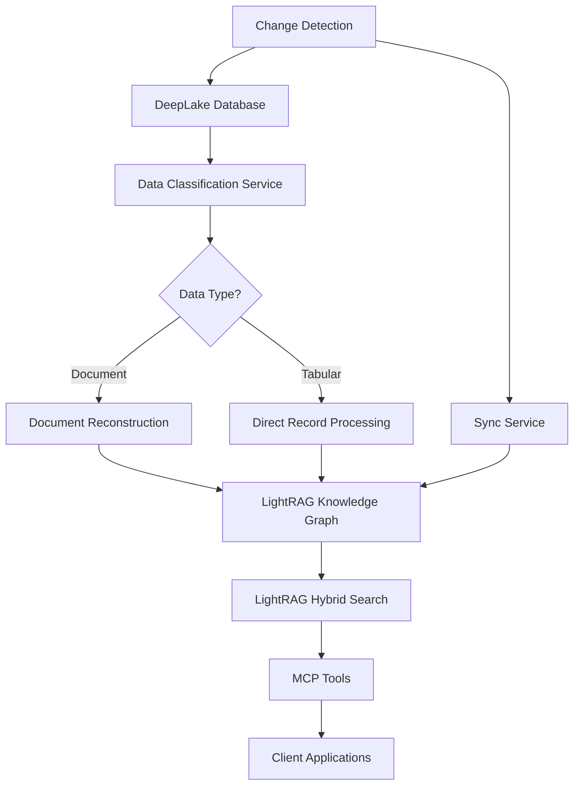
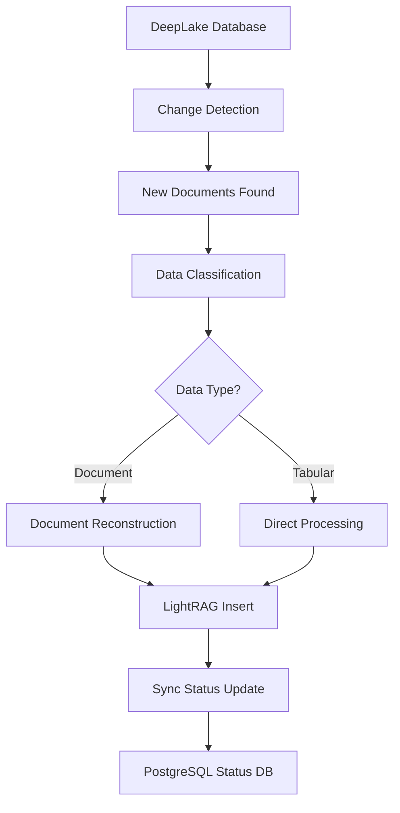

# Product Requirements Document: LightRAG Tabular Data Processing System

## 📋 **Project Overview**

### **Project Name**
LightRAG JSONL Processing System - Proof of Concept

### **Use Case**
Enhanced knowledge discovery and retrieval using LightRAG to process JSONL data from DeepLake databases, where each line of the JSONL file is treated as a separate document for LightRAG ingestion and processing.

### **Project Scope**
- **Primary Focus**: Process each JSONL line from DeepLake database as individual document in LightRAG
- **Data Source**: DeepLake database at `/media/gyasis/Drive 2/Deeplake_Storage/athena_descriptions_v4`
- **Processing Approach**: Line-by-line JSONL processing for LightRAG knowledge graph creation
- **Proof of Concept**: Validate LightRAG ingestion and query capabilities with JSONL data
- **Future Enhancement**: Build hybrid RAG system using DeepLake as input source

---

## 🎯 **Current Workflow**

### **Existing DeepLake RAG System**
- DeepLake database with chunked documents and metadata
- Vector similarity search with recency weighting
- MCP server providing search and retrieval tools
- Document reconstruction capabilities using metadata titles

### **Target LightRAG Integration**
- LightRAG as primary knowledge processing system
- DeepLake as data source (not parallel system)
- Leverage LightRAG's built-in hybrid search capabilities
- Process both document and tabular data through LightRAG

---

## 🔧 **Specific Needs**

### **Data Processing Requirements**
1. **Document-Based Data**: Reconstruct complete documents from DeepLake chunks, process through LightRAG
2. **Tabular/Record-Based Data**: Process individual records directly as entities in LightRAG knowledge graph
3. **Mixed Data Types**: Handle databases containing both document and tabular data
4. **Change Detection**: Monitor DeepLake for new/updated data, sync to LightRAG
5. **Data Classification**: Automatically identify data types for appropriate processing

### **LightRAG Capabilities to Leverage**
- **Built-in Hybrid Search**: Knowledge graph + vector search (no need for external hybrid system)
- **Dual-Level Retrieval**: Local (specific) and global (contextual) search
- **Entity-Relationship Extraction**: Automatic extraction from structured data
- **Incremental Updates**: Update knowledge graph without full regeneration
- **Multiple Storage Options**: Neo4j, PostgreSQL support
- **Cost Efficiency**: Fewer LLM calls compared to GraphRAG

---

## 🏗️ **Architecture**

### **System Architecture**


### **Data Flow**
1. **Data Source**: DeepLake database (copy to avoid corruption)
2. **Classification**: Identify document vs tabular data types
3. **Processing**: Route to appropriate LightRAG processing pipeline
4. **Storage**: LightRAG knowledge graph (Neo4j/PostgreSQL)
5. **Search**: LightRAG's built-in hybrid search capabilities
6. **Interface**: MCP tools for client access

---

## 📊 **Data Processing Pipeline**

### **Document-Based Data Processing**
```python
class DocumentProcessor:
    """
    Process document-based data through LightRAG
    """
    
    def process_document(self, deeplake_record):
        # 1. Reconstruct complete document from chunks
        complete_doc = self.reconstruct_document(deeplake_record)
        
        # 2. Send to LightRAG for knowledge graph extraction
        lightrag_result = self.lightrag.insert(complete_doc)
        
        # 3. Return processing status
        return {
            'status': 'success',
            'document_id': deeplake_record['id'],
            'lightrag_id': lightrag_result.get('id')
        }
    
    def reconstruct_document(self, record):
        # Use existing DeepLake reconstruction logic
        # Extract title from metadata
        title = record['metadata'].get('title')
        
        # Get all chunks for this document
        chunks = self.get_chunks_by_title(title)
        
        # Reconstruct complete document
        return self.combine_chunks(chunks)
```

### **Tabular Data Processing**
```python
class TabularProcessor:
    """
    Process tabular/record-based data through LightRAG
    """
    
    def process_tabular_record(self, deeplake_record):
        # 1. Extract structured data
        structured_data = self.extract_structured_data(deeplake_record)
        
        # 2. Format as LightRAG input
        lightrag_input = self.format_for_lightrag(structured_data)
        
        # 3. Send to LightRAG (will auto-extract entities/relationships)
        lightrag_result = self.lightrag.insert(lightrag_input)
        
        # 4. Return processing status
        return {
            'status': 'success',
            'record_id': deeplake_record['id'],
            'lightrag_id': lightrag_result.get('id')
        }
    
    def extract_structured_data(self, record):
        # Parse JSON data from metadata or text
        if 'structured_data' in record['metadata']:
            return json.loads(record['metadata']['structured_data'])
        
        # Extract from text content
        return self.parse_text_to_structured(record['text'])
    
    def format_for_lightrag(self, structured_data):
        # Format as readable text for LightRAG processing
        content_parts = []
        for field, value in structured_data.items():
            content_parts.append(f"{field}: {value}")
        
        return " | ".join(content_parts)
```

### **Data Classification Service**
```python
class DataClassificationService:
    """
    Classify data types for appropriate processing
    """
    
    def classify_data_type(self, metadata):
        """
        Classify as document or tabular based on metadata
        """
        # Document indicators
        doc_indicators = [
            'title' in metadata,
            'summary' in metadata,
            'web_address' in metadata,
            metadata.get('chunk_count', 0) > 1
        ]
        
        # Tabular indicators
        tab_indicators = [
            'record_id' in metadata,
            'table_name' in metadata,
            'row_number' in metadata,
            metadata.get('chunk_count', 0) == 1,
            'structured_data' in metadata
        ]
        
        if sum(doc_indicators) >= 2:
            return 'document'
        elif sum(tab_indicators) >= 2:
            return 'tabular'
        else:
            return 'unknown'
```

---

## 🔄 **Change Detection & Synchronization**

### **Change Detection Service**
```python
class ChangeDetectionService:
    """
    Monitor DeepLake for changes and sync to LightRAG
    """
    
    def __init__(self, deeplake_db, lightrag_client):
        self.deeplake_db = deeplake_db
        self.lightrag_client = lightrag_client
        self.classifier = DataClassificationService()
        self.document_processor = DocumentProcessor(lightrag_client)
        self.tabular_processor = TabularProcessor(lightrag_client)
    
    def detect_new_documents(self, last_sync_time):
        """
        Detect new documents since last sync
        """
        # Query DeepLake for new documents
        new_docs = self.deeplake_db.query(f"""
            SELECT * 
            WHERE metadata.timestamp > '{last_sync_time}'
            ORDER BY metadata.timestamp ASC
        """)
        
        return new_docs
    
    def sync_to_lightrag(self, documents):
        """
        Sync documents to LightRAG based on data type
        """
        results = []
        
        for doc in documents:
            data_type = self.classifier.classify_data_type(doc['metadata'])
            
            if data_type == 'document':
                result = self.document_processor.process_document(doc)
            elif data_type == 'tabular':
                result = self.tabular_processor.process_tabular_record(doc)
            else:
                result = {'status': 'skipped', 'reason': 'unknown_data_type'}
            
            results.append(result)
        
        return results
```

### **Synchronization Pipeline**


---

## 🛠️ **MCP Tools**

### **Core LightRAG Tools**
```python
# LightRAG search tools
def lightrag_search(query: str, mode: str = "hybrid", n_results: int = 10) -> dict:
    """
    Search LightRAG knowledge graph using built-in hybrid capabilities
    
    Args:
        query: Search query string
        mode: Search mode (naive, local, global, hybrid)
        n_results: Number of results to return
    
    Returns:
        Search results from LightRAG
    """

def lightrag_query(query: str, param: QueryParam) -> str:
    """
    Query LightRAG with specific parameters
    
    Args:
        query: Natural language query
        param: QueryParam object with mode and other settings
    
    Returns:
        Generated response from LightRAG
    """

# Data processing tools
def process_deeplake_to_lightrag(sample_size: int = 100) -> dict:
    """
    Process DeepLake data to LightRAG knowledge graph
    
    Args:
        sample_size: Number of records to process
    
    Returns:
        Processing results and statistics
    """

def classify_and_process_data(record_ids: list) -> dict:
    """
    Classify and process specific records from DeepLake
    
    Args:
        record_ids: List of record IDs to process
    
    Returns:
        Classification and processing results
    """

# Change detection tools
def detect_new_documents() -> dict:
    """
    Detect new documents in DeepLake since last sync
    
    Returns:
        List of new document IDs and metadata
    """

def sync_new_documents_to_lightrag(document_ids: list) -> dict:
    """
    Sync new documents to LightRAG
    
    Args:
        document_ids: List of document IDs to sync
    
    Returns:
        Sync results and status
    """

def get_sync_status() -> dict:
    """
    Get current synchronization status
    
    Returns:
        Detailed sync status and statistics
    """
```

---

## 🚀 **Implementation Plan**

### **Phase 1: Core Setup (Week 1)**
- [ ] Set up LightRAG environment with Neo4j/PostgreSQL
- [ ] Implement data classification service
- [ ] Create document reconstruction pipeline
- [ ] Implement tabular data processing pipeline

### **Phase 2: Integration (Week 1-2)**
- [ ] Integrate with DeepLake database (copy)
- [ ] Implement change detection service
- [ ] Create synchronization pipeline
- [ ] Build MCP tools for LightRAG

### **Phase 3: Testing & Optimization (Week 2)**
- [ ] Test with sample DeepLake data
- [ ] Implement proof of concept for mixed data types
- [ ] Performance optimization
- [ ] Error handling and logging

### **Phase 4: Production (Week 2)**
- [ ] Containerization with Docker
- [ ] Production deployment
- [ ] Monitoring and health checks
- [ ] Documentation and training

---

## 📡 **REST API Endpoints**

```yaml
endpoints:
  lightrag_search:
    POST /api/v1/lightrag/search:
      description: "Search LightRAG knowledge graph"
      parameters:
        - query: string (required)
        - mode: string (naive, local, global, hybrid)
        - n_results: integer (default: 10)
    
    POST /api/v1/lightrag/query:
      description: "Query LightRAG with natural language"
      parameters:
        - query: string (required)
        - mode: string (default: hybrid)
  
  data_processing:
    POST /api/v1/process/deeplake-to-lightrag:
      description: "Process DeepLake data to LightRAG"
      parameters:
        - sample_size: integer (default: 100)
    
    POST /api/v1/process/classify-and-process:
      description: "Classify and process specific records"
      parameters:
        - record_ids: array of strings
    
    GET /api/v1/process/stats:
      description: "Get processing statistics"
  
  synchronization:
    GET /api/v1/sync/detect-new:
      description: "Detect new documents in DeepLake"
    
    POST /api/v1/sync/process:
      description: "Sync new documents to LightRAG"
      parameters:
        - document_ids: array of strings
    
    GET /api/v1/sync/status:
      description: "Get synchronization status"
  
  system:
    GET /api/v1/system/health:
      description: "System health check"
    
    GET /api/v1/system/stats:
      description: "System performance statistics"
```

---

## 🧪 **Testing Strategy**

### **Unit Tests**
- Data classification accuracy
- Document reconstruction correctness
- Tabular data processing
- Change detection logic

### **Integration Tests**
- DeepLake to LightRAG data flow
- MCP tool functionality
- API endpoint responses
- Synchronization pipeline

### **Performance Tests**
- LightRAG search response times
- Data processing throughput
- Memory usage optimization
- Concurrent request handling

### **Proof of Concept Tests**
- Mixed data type processing
- Large dataset handling
- Error recovery scenarios
- End-to-end workflow validation

---

## 🐳 **Containerization**

### **Docker Configuration**
```dockerfile
FROM python:3.11-slim

WORKDIR /app

# Install system dependencies
RUN apt-get update && apt-get install -y \
    build-essential \
    curl \
    && rm -rf /var/lib/apt/lists/*

# Install Python dependencies
COPY requirements.txt .
RUN pip install --no-cache-dir -r requirements.txt

# Copy application code
COPY . .

# Expose ports
EXPOSE 8000 7474 7687

# Health check
HEALTHCHECK --interval=30s --timeout=10s --start-period=5s --retries=3 \
    CMD curl -f http://localhost:8000/api/v1/system/health || exit 1

# Start services
CMD ["python", "main.py"]
```

### **Docker Compose**
```yaml
version: '3.8'

services:
  lightrag:
    build: .
    ports:
      - "8000:8000"
    environment:
      - OPENAI_API_KEY=${OPENAI_API_KEY}
      - NEO4J_URI=bolt://neo4j:7687
      - NEO4J_USERNAME=neo4j
      - NEO4J_PASSWORD=${NEO4J_PASSWORD}
    depends_on:
      - neo4j
      - postgres
    volumes:
      - ./data:/app/data
      - ./logs:/app/logs

  neo4j:
    image: neo4j:5.15
    ports:
      - "7474:7474"
      - "7687:7687"
    environment:
      - NEO4J_AUTH=neo4j/${NEO4J_PASSWORD}
    volumes:
      - neo4j_data:/data

  postgres:
    image: postgres:15
    ports:
      - "5432:5432"
    environment:
      - POSTGRES_DB=lightrag
      - POSTGRES_USER=lightrag
      - POSTGRES_PASSWORD=${POSTGRES_PASSWORD}
    volumes:
      - postgres_data:/var/lib/postgresql/data

volumes:
  neo4j_data:
  postgres_data:
```

---

## 📊 **Operational Considerations**

### **Monitoring**
- LightRAG search performance metrics
- Data processing throughput
- Memory and CPU usage
- Error rates and response times

### **Logging**
- Data classification decisions
- Processing success/failure rates
- Synchronization status
- Performance bottlenecks

### **Error Handling**
- Graceful degradation for LightRAG failures
- Retry mechanisms for sync operations
- Data validation and integrity checks
- Fallback to DeepLake search if needed

### **Security**
- API key management
- Database access controls
- Input validation and sanitization
- Rate limiting and DDoS protection

---

## ✅ **Acceptance Criteria**

### **Functional Requirements**
- [ ] Successfully process document-based data through LightRAG
- [ ] Successfully process tabular data as entities in LightRAG
- [ ] Automatically classify data types (document vs tabular)
- [ ] Implement change detection for DeepLake updates
- [ ] Sync new data to LightRAG automatically
- [ ] Provide MCP tools for LightRAG search and processing
- [ ] Support LightRAG's built-in hybrid search modes
- [ ] Handle mixed data types in same database
- [ ] Achieve <2s response time for LightRAG queries
- [ ] Maintain data integrity throughout processing pipeline

### **Non-Functional Requirements**
- [ ] Containerized deployment ready
- [ ] Comprehensive error handling and logging
- [ ] Complete API documentation
- [ ] Performance benchmarking completed
- [ ] Security best practices implemented
- [ ] Monitoring and health checks in place

### **Quality Requirements**
- [ ] >90% test coverage for core functionality
- [ ] Code review completed for all components
- [ ] Performance testing passed
- [ ] Security audit completed
- [ ] Documentation review completed
- [ ] User acceptance testing passed

---

## 📚 **References**

### **LightRAG Documentation**
- [LightRAG GitHub Repository](https://github.com/HKUDS/LightRAG)
- [LightRAG Paper](https://lightrag.github.io/)
- [LightRAG Installation Guide](https://github.com/HKUDS/LightRAG#installation)

### **DeepLake Integration**
- [DeepLake v4 API Documentation](https://docs.activeloop.ai/)
- [DeepLake TQL Query Reference](https://docs.activeloop.ai/deeplake-vs-other-databases/tql)
- [DeepLake Python SDK](https://docs.activeloop.ai/getting-started/deeplake-basics)

### **Knowledge Graph Resources**
- [Neo4j Documentation](https://neo4j.com/docs/)
- [PostgreSQL Documentation](https://www.postgresql.org/docs/)
- [Knowledge Graph Best Practices](https://neo4j.com/developer/kb/)

---

**Document Version**: 1.0  
**Last Updated**: December 2024  
**Status**: Draft  
**Next Review**: Implementation Phase 1 Completion

